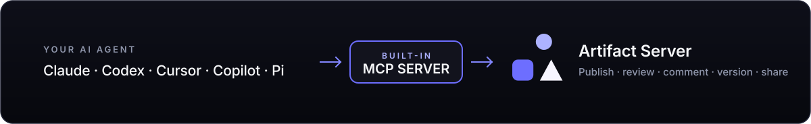
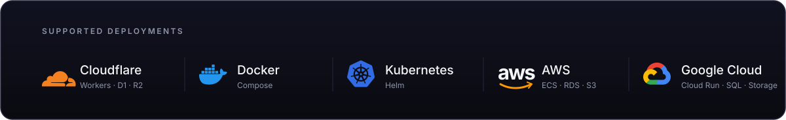

# Artifact Server

**The self-hostable, open-source alternative to Claude Code artifacts.**

Artifact Server gives people and agents one place to publish, review, comment on, version, and share the artifacts they create while building products. Its built-in MCP server gives agents direct access to the same work.

Run it on a laptop for one developer. Deploy it for a private team on Cloudflare, one server, Kubernetes, AWS, or Google Cloud.

<p align="center">
  <a href="https://github.com/backnotprop/plannotator"></a>
  &nbsp;&nbsp;&nbsp;&nbsp;
  <a href="https://plannotator.ai/workspaces"></a>
</p>

## Contents

- [Why Artifact Server](#why-artifact-server)
- [Built for AI agents](#built-for-ai-agents)
- [Cloudflare and Artifact Server](#cloudflare-and-artifact-server)
- [Run it locally](#run-it-locally)
- [Deploy it for a team](#deploy-it-for-a-team)
- [Usage](#usage)
- [Security model](#security-model)
- [Development and project records](#development-and-project-records)

## Why Artifact Server

Teams now use HTML, images, and video for plans, mockups, prototypes, code reviews, and other work created during product development. That work quickly becomes disorganized, and providers try to lock it inside their platforms.

Artifact Server gives teams a self-hosted place to organize and collaborate on that work. Store artifacts by project, share them, comment on them, and keep control of the files and data.

## Built for AI agents

<p>
  
  &nbsp;&nbsp;
  <picture>
    <source media="(prefers-color-scheme: dark)" srcset="./apps/web/src/review/assets/agents/codex-dark.svg">
    
  </picture>
  &nbsp;&nbsp;
  <picture>
    <source media="(prefers-color-scheme: dark)" srcset="./apps/web/src/review/assets/agents/cursor-dark.svg">
    
  </picture>
  &nbsp;&nbsp;
  <picture>
    <source media="(prefers-color-scheme: dark)" srcset="./apps/web/src/review/assets/agents/copilot-dark.svg">
    
  </picture>
  &nbsp;&nbsp;
  <picture>
    <source media="(prefers-color-scheme: dark)" srcset="./apps/web/src/review/assets/agents/pi.svg">
    
  </picture>
</p>

<a href="./docs/mcp.md"></a>

Artifact Server includes a built-in MCP server and a portable Agent Skill. Agents can publish, organize, review, comment on, and share versioned artifacts.

Connect the agent and install the skill:

```sh
artifactserver connect
npx skills add plannotator/artifact-server
```

Then ask:

```text
/artifact-server upload that HTML design doc
```

The agent returns the full-screen review link first. [Read the MCP guide](./docs/mcp.md) for source checkouts, remote servers, permissions, and supported operations.

<a href="./integrations/pi/README.md"></a>

## Cloudflare and Artifact Server

Cloudflare is the main hosted deployment target. Cloudflare Artifacts adds optional Git history, but it is not generally available. You must sign up for access, so the integration is off by default.

<a href="./docs/cloudflare-artifacts.md"></a>

- [Deploy Artifact Server on Cloudflare](./deploy/cloudflare/README.md)
- [Use Cloudflare Artifacts for optional Git history](./docs/cloudflare-artifacts.md)
- [Read the Cloudflare Artifacts documentation](https://developers.cloudflare.com/artifacts/)

Cloudflare is optional. Artifact Server also runs locally, on Compose, on Kubernetes, on AWS, and on Google Cloud.

[](./docs/deployment.md)

## Run it locally

Local mode stores metadata in SQLite and files on disk. It grants owner access only from the same loopback origin. It requires Node.js 24.12+ and pnpm 10.34.3.

```sh
git clone https://github.com/plannotator/artifact-server.git
cd artifact-server
pnpm install
pnpm dev
```

Open the printed URL. Packaged installs use `artifactserver open` instead.

## Deploy it for a team

Every remote deployment uses one trusted application origin and one isolated wildcard content domain.

| Deployment | Data layer | Guide |
| --- | --- | --- |
| Cloudflare | D1 and R2 (in preview: Artifacts) | [Cloudflare guide](./deploy/cloudflare/README.md) |
| Compact Compose | SQLite and one file volume | [Compose guide](./packaging/compose/README.md) |
| External-storage Compose | PostgreSQL and S3-compatible storage | [Compose guide](./packaging/compose/README.md) |
| Kubernetes | PostgreSQL and object storage | [Helm guide](./packaging/helm/artifact-server/README.md) |
| AWS | ECS, RDS, and S3 | [AWS Pulumi guide](./deploy/pulumi/aws/README.md) |
| Google Cloud | Cloud Run, Cloud SQL, and Cloud Storage | [Google Cloud Pulumi guide](./deploy/pulumi/gcp/README.md) |

[Read the deployment guide](./docs/deployment.md) for shared requirements, storage choices, authentication, and backups.

## Usage

Most artifacts are published by an agent through the [Artifact Server Skill](./skills/artifact-server/SKILL.md) or [MCP](./docs/mcp.md). For direct access, use the `artifactserver` CLI to publish files and directories, connect to remote servers, and create new versions. [Read the CLI guide](./docs/cli.md).

## Security model

Artifact Server serves untrusted artifact content from isolated version hosts, separate from the trusted application origin used for authentication, review, comments, API, and MCP. Private content uses version-scoped browser sessions, and untrusted paths cannot select storage locations.

Read the [security model](./project/spec/decisions/0002-shared-identity-and-private-content.md) or [report a vulnerability](./SECURITY.md).

Read about Artifact Server's [software supply-chain security](https://artifactserver.com/docs/security/).

## Development and project records

Install dependencies and run the focused development checks:

```sh
pnpm install
pnpm check
pnpm test:web
```

Run the complete iteration gate before a handoff:

```sh
pnpm verify:iteration
```

Repository engineering rules live in [AGENTS.md](./AGENTS.md).

The [`project`](./project) directory contains specifications, conformance evidence, performance records, prototypes, and research. Start with:

- [Product specification](./project/spec/artifact-server-product-spec.html)
- [Conformance ledger](./project/spec/conformance.yml)
- [MCP baseline](./project/spec/artifact-server-mcp-baseline.md)
- [Performance findings](./project/performance/FINDINGS.md)
- [Project records index](./project/README.md)

Public guides live in the [documentation index](./docs/README.md).

---

<p align="center">
  <a href="https://github.com/backnotprop/plannotator"></a>
  &nbsp;&nbsp;&nbsp;&nbsp;
  <a href="https://plannotator.ai/workspaces"></a>
</p>

<p align="center">
  created by <a href="https://x.com/backnotprop">backnotprop</a>
</p>
