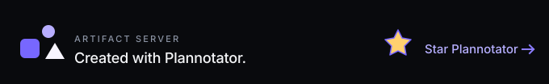

# Artifact Server

**The self-hostable, open-source alternative to Claude Code artifacts.**

Artifact Server gives people and agents one place to publish, review, comment on, version, and share finished browser artifacts.

Run it on a laptop for one developer. Deploy it for a private team on one server, Kubernetes, Cloudflare, AWS, or Google Cloud.

> [!IMPORTANT]
> Artifact Server is pre-release software. Public packages, support commitments, and the repository license are not final. Treat `main` as development software.

## Contents

- [Why Artifact Server](#why-artifact-server)
- [What it does](#what-it-does)
- [Run it locally](#run-it-locally)
- [Deploy it for a team](#deploy-it-for-a-team)
- [Publish and review artifacts](#publish-and-review-artifacts)
- [Connect an AI agent](#connect-an-ai-agent)
- [Use optional Git history with Cloudflare Artifacts](#use-optional-git-history-with-cloudflare-artifacts)
- [Understand the security boundary](#understand-the-security-boundary)
- [Develop Artifact Server](#develop-artifact-server)
- [Read the specifications](#read-the-specifications)

## Why Artifact Server

Agents create useful work that does not belong in an application repository. Examples include plans, reports, screenshots, prototypes, diagrams, and complete websites.

Chat attachments lose context. Temporary preview links expire. Source repositories mix generated output with product code.

Artifact Server gives that work a durable home:

| Need                           | Artifact Server behavior                                            |
| ------------------------------ | ------------------------------------------------------------------- |
| Revisit an earlier result      | Every save creates an immutable version.                            |
| Share the latest result        | A stable artifact link follows the current version.                 |
| Review one exact result        | A review link opens that version full screen with comments.         |
| Run generated HTML safely      | Artifact content uses a separate browser origin.                    |
| Publish from an agent          | MCP, CLI, and HTTP use the same product operations.                 |
| Keep control of data           | Self-host the application and its storage.                          |
| Give Git-aware tools a handoff | Enable optional Cloudflare Artifacts history for selected projects. |

## What it does

- Publishes one file or a complete directory.
- Stores immutable versions with canonical file manifests.
- Previews HTML, images, and video in the Workbench.
- Supports full-screen review and exact-version comments.
- Returns stable, exact-version, raw, and review links after publication.
- Supports private artifacts and public links.
- Organizes artifacts by project and tag.
- Restores an earlier version by moving the current pointer.
- Connects Codex, Claude Code, Cursor, and VS Code through MCP.
- Supports local access without a sign-in form on an exact loopback origin.
- Supports private-team login through WorkOS or a generic OIDC provider.
- Runs with local storage or external PostgreSQL and object storage.

The product model stays small:

```text
Artifact Server installation
└── Project
    └── Artifact
        ├── Version 1 (immutable)
        ├── Version 2 (immutable)
        └── Current pointer → Version 2
```

One installation represents one person, team, or company. Every installation starts with a default project.

[](https://github.com/backnotprop/plannotator)

## Run it locally

Use the local target for one developer on one machine. It stores records in SQLite and files on local disk.

### Requirements

- Node.js 24.12 or newer
- pnpm 10.34.3
- Git

### Start from source

```sh
git clone https://github.com/plannotator/artifact-server.git
cd artifact-server
pnpm install
pnpm dev
```

The development Workbench starts at `http://127.0.0.1:5173/workbench`. The backend starts at `http://127.0.0.1:8787`.

Open the local application from another terminal:

```sh
node --import tsx src/cli/main.ts open --data .artifact-server
```

A fresh browser profile receives a local-owner session automatically. Local-owner access works only on an exact loopback origin.

Publish a first artifact:

```sh
node --import tsx src/cli/main.ts publish ./report.html \
  --data .artifact-server \
  --name "Release report"
```

The command returns JSON with the project, artifact, version, and relevant browser links.

> [!CAUTION]
> Do not expose the local-owner target to another device or a public network. Use a private-team deployment for remote access.

### Build the local release archive

```sh
pnpm package:local
tar -xzf release/artifact-server-*-node.tar.gz
./artifactserver/bin/artifactserver --version
./artifactserver/bin/artifactserver open
```

The archive contains the compiled application and production dependencies. Node.js is its only runtime requirement.

## Deploy it for a team

Artifact Server keeps product behavior independent from its deployment provider. Choose the runtime and storage that fit your team.

All listed deployment packages are pre-release. The status column describes implementation maturity, not a support contract.

| Deployment               | Best fit                                                  | Data layer                              | Current status         | Guide                                                      |
| ------------------------ | --------------------------------------------------------- | --------------------------------------- | ---------------------- | ---------------------------------------------------------- |
| Compact Compose          | One private team on one server                            | SQLite and one file volume              | Implemented package    | [Compose guide](./packaging/compose/README.md)             |
| External-storage Compose | A small team that needs replaceable application processes | PostgreSQL and S3-compatible storage    | Implemented package    | [Compose guide](./packaging/compose/README.md)             |
| Kubernetes               | A team with an existing cluster and managed data services | PostgreSQL and object storage           | Implemented Helm chart | [Helm guide](./packaging/helm/artifact-server/README.md)   |
| Cloudflare               | A serverless installation on Workers                      | D1 and R2                               | Technical preview      | [Cloudflare guide](./deploy/cloudflare/README.md)          |
| AWS                      | A direct managed-cloud stack                              | ECS, RDS, and S3                        | Technical preview      | [AWS Pulumi guide](./deploy/pulumi/aws/README.md)          |
| Google Cloud             | A direct managed-cloud stack                              | Cloud Run, Cloud SQL, and Cloud Storage | Technical preview      | [Google Cloud Pulumi guide](./deploy/pulumi/gcp/README.md) |

### Remote deployment requirements

Every remote deployment needs these boundaries:

1. Configure one HTTPS application origin.
2. Configure a separate wildcard content domain.
3. Configure WorkOS or one generic OIDC provider.
4. Admit team members through Artifact Server.
5. Store service credentials outside source control.
6. Back up both the database and artifact bytes.
7. Use an immutable container-image digest for release deployments.

The application origin serves the Workbench, API, and MCP endpoint. The wildcard content domain serves untrusted artifact files.

### Start Compact Compose

Copy [`packaging/compose`](./packaging/compose) to the target server. Then create the local configuration file.

```sh
cp .env.example .env
```

Set the immutable image digest and identity-provider configuration in `.env`. Then initialize and start the installation.

```sh
docker compose run --rm --no-deps artifact-server \
  init --admin-email admin@example.com \
  --data /var/lib/artifact-server/data

docker compose up --detach --wait
```

Compact Compose runs one application process. Do not scale that service.

Use External-storage Compose or Kubernetes when the application process must be replaceable or horizontally scaled.

## Publish and review artifacts

The CLI accepts a finished file or directory. It does not wrap file contents in JSON or MCP arguments.

```sh
artifactserver publish ./report.pdf
artifactserver publish ./dist \
  --public \
  --name "Product prototype" \
  --tag prototype
```

For a remote server, sign in once and save a named profile:

```sh
artifactserver auth login https://artifacts.example.com --name team
artifactserver publish ./dist --profile team
```

Publication returns three human-relevant links:

| Link             | Use it for                                                                   |
| ---------------- | ---------------------------------------------------------------------------- |
| `links.review`   | Open the exact version full screen and comment on it. Share this link first. |
| `links.artifact` | Open the stable artifact link that follows the current version.              |
| `links.version`  | Open the immutable raw version without the Artifact Server interface.        |

The MCP server tells agents to give users `links.review` first. It tells them to include the raw version when that link is useful.

To publish another immutable version, provide the artifact ID and expected current version:

```sh
artifactserver publish ./dist \
  --artifact art_example \
  --expected-version ver_example
```

The expected version prevents an old client from silently overwriting a newer current pointer.

### Use the HTTP upload protocol

Custom clients use the staged file-upload API:

1. Create an upload with file paths, media types, sizes, and SHA-256 values.
2. Upload raw file bytes to the returned opaque locations.
3. Commit the upload with an idempotency key and publication target.

The commit creates one canonical manifest and one immutable version. The server rejects incomplete uploads and mismatched file fingerprints.

## Connect an AI agent

Connect a supported local client with one command:

```sh
artifactserver connect codex
artifactserver connect claude
artifactserver connect cursor
artifactserver connect vscode
```

The command installs a user-scoped MCP entry and checks modern discovery. It does not place a credential in the client configuration.

Use these commands to inspect or remove the connection:

```sh
artifactserver doctor codex
artifactserver disconnect codex
```

A remote deployment exposes its MCP server at `/mcp`. The identity provider handles agent authorization for that exact resource.

### Install the publishing skill

Install the portable Agent Skill from this repository:

```sh
npx skills add plannotator/artifact-server
```

The skill uses the CLI for files on the developer's machine. It uses MCP when the connected agent already has the data and context.

The skill source lives in [`skills/publish-artifact`](./skills/publish-artifact).

## Use optional Git history with Cloudflare Artifacts


[Cloudflare Artifacts](https://developers.cloudflare.com/artifacts/) provides versioned storage through Workers bindings, a REST API, and standard Git smart HTTP.

Artifact Server uses it as an optional Git handoff. Artifact Server remains the source of truth for publication, review, delivery, comparison, backup, and recovery.

The accepted design has these rules:

- Git history is off by default on every deployment.
- An operator makes the provider available through explicit configuration.
- Every new and existing project starts with Git history disabled.
- A project administrator reviews an estimate before enabling one project.
- Each artifact receives one private repository.
- Each saved version creates one deterministic commit.
- Authorized members receive short-lived, repository-scoped read access.
- Provider failure never blocks artifact publication or delivery.
- Disabling the feature does not delete repositories.

The default configuration makes no provider request:

```sh
ARTIFACT_SERVER_GIT_HISTORY_PROVIDER=off
```

An operator can explicitly select Cloudflare Artifacts:

```sh
ARTIFACT_SERVER_GIT_HISTORY_PROVIDER=cloudflare-artifacts
```

Provider selection makes the integration available. It does not copy data. A project administrator still enables each project separately.

### Why one repository per artifact

One repository per artifact gives each artifact an independent history, token, lifecycle, and deletion boundary.

Cloudflare bills aggregate storage and operations, not repository count. Cloudflare currently lists unlimited repositories and a 10 GB limit per repository.

Read the current [pricing](https://developers.cloudflare.com/artifacts/platform/pricing/) and [limits](https://developers.cloudflare.com/artifacts/platform/limits/) before enabling the integration.

### Integration status

The configuration, provider-health check, discovery response, durable provider identity, estimate, and per-project switch exist.

Repository creation, mirror workers, Cloudflare writes, clone-token handoff, deletion, and complete release evidence remain in development.

Do not treat Cloudflare Git history as a shipped feature yet. Cloudflare also labels Artifacts as closed beta.

Read the complete contract in [`spec/git-history-spec.md`](./spec/git-history-spec.md) and [ADR 0026](./spec/decisions/0026-cloudflare-artifacts-configurable-git-handoff.md).

Cloudflare is a deployment target and an optional integration. Artifact Server does not require Cloudflare Artifacts on Cloudflare or any other platform.

## Understand the security boundary

Artifact Server gives generated HTML a large canvas without giving it access to the trusted application session.

```text
Application origin
  Workbench, API, MCP, authentication, comments
        │
        │ sandboxed review protocol
        ▼
Content origin
  Immutable artifact files on isolated version hosts
```

The server also enforces these rules:

- Untrusted paths never select storage locations.
- Private content uses version-scoped browser sessions.
- Public access never exposes Git credentials or private version history.
- Publication requires complete file sizes and SHA-256 fingerprints.
- Version bytes and IDs remain stable across retries and restarts.
- Administrative changes use capabilities, expected versions, and idempotency keys.

Read the [security-boundary specification](./spec/decisions/0002-shared-identity-and-private-content.md) for the full model.

## Develop Artifact Server

Install dependencies and start the development processes:

```sh
pnpm install
pnpm dev
```

Use focused checks while you work:

```sh
pnpm check
pnpm test:web
pnpm smoke
```

Run the complete iteration gate before a handoff:

```sh
pnpm verify:iteration
```

The complete gate runs static checks, conformance tests, builds, package tests, storage tests, deployment tests, and bounded performance checks.

Repository engineering rules live in [`AGENTS.md`](./AGENTS.md). Important rules include:

- Keep product logic independent from storage, transport, MCP, and deployment providers.
- Put concrete providers behind narrow product-behavior ports.
- Do not use module mocks.
- Test observable behavior and recovery.
- Attach durable evidence before marking a conformance requirement complete.

## Read the specifications

Artifact Server uses a product specification and a machine-checkable conformance ledger.

- [Product specification](./spec/artifact-server-product-spec.html)
- [Conformance ledger](./spec/conformance.yml)
- [MCP baseline](./spec/artifact-server-mcp-baseline.md)
- [Local workspace specification](./spec/local-workspace-spec.md)
- [Git history specification](./spec/git-history-spec.md)
- [Deployment and history plan](./spec/phase-9-distribution-and-history.md)
- [Performance findings](./performance/FINDINGS.md)

The public documentation site source lives in [`apps/site`](./apps/site). Its deployment and canonical domain remain release tasks.

## Project status and independence

Artifact Server is an independent Plannotator project. It is not affiliated with Anthropic or Cloudflare.

The product and deployment packages are under active development. The conformance ledger, not this README, is the release authority.

The repository does not yet contain a final open-source license. Select and add an OSI-approved license before the first supported release.
