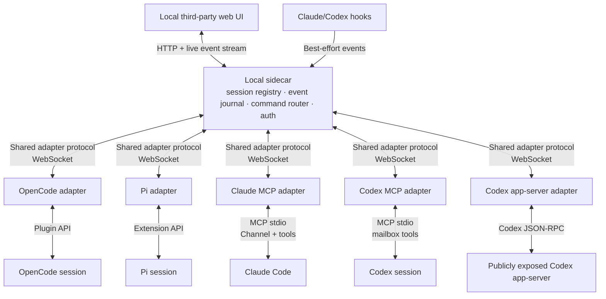
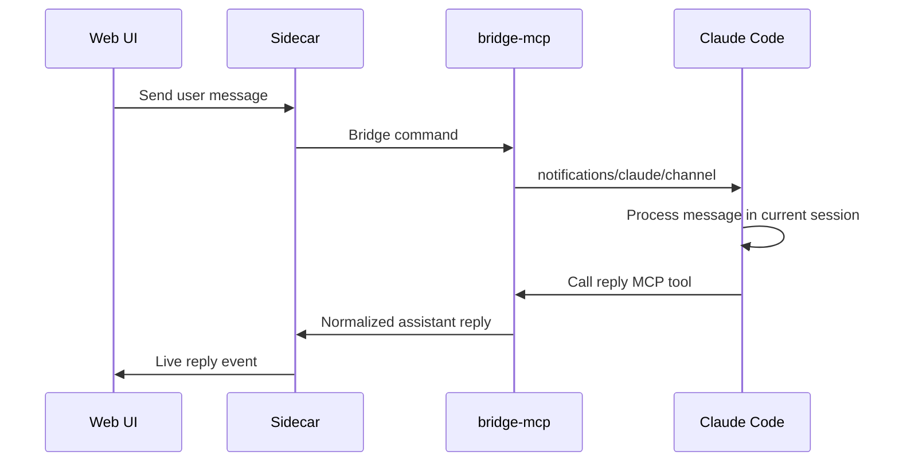

No—everything should not go through MCP.

MCP is one harness-facing transport. The common backbone is our own small bridge protocol between harness adapters and the local sidecar.



The architectural rule is:

> Standardize everything above the adapter; use the strongest native mechanism below it.

### Which integrations require MCP?

| Adapter | Uses MCP? | Actual mechanism |
|---|---:|---|
| OpenCode plugin | No | JavaScript/TypeScript plugin running inside OpenCode |
| Pi extension | No | Pi extension running inside the active Pi process |
| Claude Channel | Yes | MCP server with Anthropic’s `claude/channel` extension |
| Claude baseline | Yes | Ordinary MCP mailbox tools, supplemented by hooks |
| Codex baseline | Yes | Ordinary MCP mailbox tools, supplemented by hooks |
| Codex app-server | No | Codex-specific JSON-RPC protocol over a public socket/WebSocket |

“Plugin” describes how something is installed and loaded. It does not imply MCP.

- The OpenCode plugin directly receives OpenCode events and calls OpenCode’s native session client.
- The Pi extension directly receives Pi events and calls `sendUserMessage`.
- A Claude Channel may also be packaged as a Claude plugin, but the thing inside that package is an MCP server.

### Shared interface

Every adapter translates its native API into approximately this contract:

```ts
interface HarnessAdapter {
  listSessions(): Promise<Session[]>;
  send(sessionId: string, command: MessageCommand): Promise<DeliveryResult>;
  interrupt?(sessionId: string): Promise<DeliveryResult>;
}

type MessageCommand = {
  clientMessageId: string;
  text: string;
  mode: "follow_up" | "steer";
};

type SessionEvent =
  | { kind: "message_upsert"; message: Message }
  | { kind: "status"; status: "idle" | "busy" | "error" }
  | { kind: "metadata"; title?: string; cwd?: string }
  | { kind: "error"; message: string };
```

The browser therefore does not know about MCP, Pi APIs, OpenCode events, or Codex JSON-RPC. It sees:

- sessions
- capabilities
- messages and activity
- send/steer/interrupt commands
- delivery receipts

The capability object is important because these integrations are not equivalent:

```ts
type Capabilities = {
  view: boolean;
  send: boolean;
  steer: boolean;
  interrupt: boolean;
  wakesAgent: boolean;
  inputTransport: "native" | "channel" | "mailbox";
};
```

### Pi and OpenCode

These are the cleanest integrations.

Their adapters contain the shared bridge client and connect outward to the sidecar:

```text
Pi/OpenCode native API
        ↕
thin harness adapter
        ↕
shared BridgeClient
        ↕
local sidecar
```

They do not need MCP anywhere.

The adapter callbacks enqueue events locally and return immediately. If the sidecar is absent, crashes, or restarts, the native agent continues normally. That satisfies the “agent is critical infrastructure” requirement.

One correction to your table: the current OpenCode prototype supports native message submission and abort, but it does not yet claim genuine mid-turn steering. Pi does expose explicit steer/follow-up semantics.

### Claude Channels

Claude is the one place where MCP is the correct native edge.

The process Claude starts over MCP would also connect to our sidecar:



The same `bridge-mcp` codebase could have two modes:

- `claude-channel`: advertises `claude/channel`, sends unsolicited notifications, and exposes a reply tool.
- `mailbox`: exposes ordinary `receive_messages` and `reply` tools, but cannot wake the agent.

Anthropic explicitly defines Channels as an MCP server spawned locally over stdio. Inbound messages use `notifications/claude/channel`; two-way responses use an ordinary MCP reply tool. Channels require per-session opt-in and are currently a research preview. [Claude Channels reference](https://code.claude.com/docs/en/channels-reference)

Important limitation: the reply tool gives us the reply intended for the web conversation. It does not automatically mirror every token or every piece of Claude’s native terminal transcript. Hooks can supplement lifecycle/tool activity.

### Baseline MCP mailbox

For Claude without Channels and for ordinary Codex sessions:

```text
Web message
    ↓
sidecar mailbox
    ↓
agent eventually calls receive_messages()
    ↓
agent sees message and acts
    ↓
agent calls reply()
    ↓
web UI
```

That is not true inbound push. The message may sit pending forever unless:

- the agent is instructed to poll;
- a scheduled action polls;
- the user submits another native turn; or
- some future client feature wakes it.

The UI must say “queued in mailbox,” not “delivered to session.”

This MCP implementation can be substantially shared between Claude and Codex. The hook configuration and event normalization remain harness-specific.

### Codex app-server

Codex app-server does not use MCP. It uses a separate JSON-RPC protocol that happens to resemble MCP.

When a Codex app-server is already available through a Unix socket or WebSocket, an adapter could:

- discover threads with `thread/list` and `thread/loaded/list`;
- read history with `thread/read`;
- subscribe using `thread/resume`;
- send idle input with `turn/start`;
- steer active work with `turn/steer`;
- cancel with `turn/interrupt`;
- normalize `thread/*`, `turn/*`, and `item/*` notifications.

Those are real native operations documented by OpenAI. [Codex App Server documentation](https://learn.chatgpt.com/docs/app-server)

But that does not solve the current Electron app: the official Codex app presently owns a private stdio app-server connection. Our adapter has no supported endpoint to attach to. Therefore:

- Public/shared app-server: full native adapter, no MCP.
- Current ordinary Codex Electron session: mailbox/hooks only.
- Session transcript monitoring: partial outbound visibility, not full-duplex control.

### What is actually shared?

Roughly:

- 100% shared: local web UI, sidecar, local authentication, session registry, journal, capability handling, delivery tracking.
- Nearly 100% shared: adapter WebSocket client, reconnect behavior, queues, normalized message/event types.
- Partially shared: Claude/Codex MCP mailbox server and hook collector.
- Harness-specific: Pi extension glue, OpenCode plugin glue, Claude Channel methods, Codex app-server JSON-RPC.
- Not shareable: the actual native injection and event APIs.

The current code already implements the shared core plus Pi and OpenCode:

- [Formal specification](/Users/ramos/oss/agent-comms/LIVE_SESSION_BRIDGE_PROTOTYPE_SPEC.md)
- [Shared protocol](/Users/ramos/oss/agent-comms/live-session-bridge/packages/protocol/src/index.ts)
- [Shared adapter client](/Users/ramos/oss/agent-comms/live-session-bridge/packages/client/src/index.ts)
- [Pi adapter](/Users/ramos/oss/agent-comms/live-session-bridge/adapters/pi/src/index.ts)
- [OpenCode adapter](/Users/ramos/oss/agent-comms/live-session-bridge/adapters/opencode/src/index.ts)

The Claude and Codex adapters in this explanation are still architectural designs, not implemented parts of the prototype.