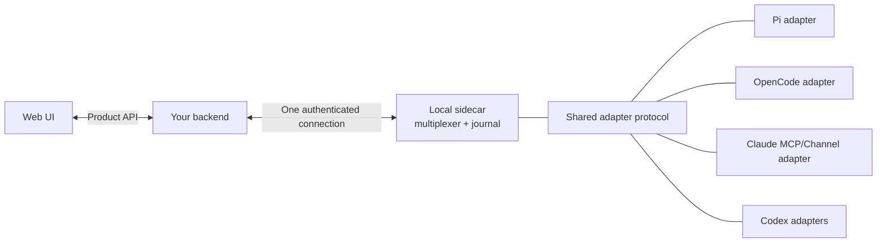

Yes. The important move is to make the sidecar an agent-neutral protocol gateway. Agent-specific behavior should stop at the adapter.



If your backend is local, collapse `Backend` and `Sidecar` into one process.

## The minimum common protocol

All adapters should expose the same three concepts:

### 1. Session registration and capabilities

```ts
type AgentSession = {
  id: string;                 // Globally unique bridge ID
  deviceId: string;
  harness: "pi" | "opencode" | "claude" | "codex";
  nativeSessionId: string;
  adapterInstanceId: string;
  adapterEpoch: string;       // Changes when adapter restarts
  title?: string;
  cwd?: string;
  status: "idle" | "busy" | "error" | "disconnected";

  capabilities: {
    view: boolean;
    send: boolean;
    wake: boolean;
    steer: boolean;
    interrupt: boolean;
    history: "none" | "snapshot" | "structured";
    streaming: "none" | "messages" | "deltas";
    inputTransport: "native" | "channel" | "mailbox";
  };
};
```

Capabilities must be reported per session. Do not write backend logic like:

```ts
if (session.harness === "pi") showSteerButton();
```

Instead:

```ts
if (session.capabilities.steer) showSteerButton();
```

That lets future versions of an agent gain capabilities without changing your product API.

### 2. Normalized event envelopes

```ts
type AgentEvent = {
  version: 1;
  eventId: string;
  sessionId: string;
  epoch: string;
  sequence: number;
  timestamp: string;

  kind:
    | "message.upsert"
    | "status.changed"
    | "tool.started"
    | "tool.completed"
    | "approval.requested"
    | "question.requested"
    | "session.metadata"
    | "session.closed"
    | "diagnostic";

  payload: unknown;

  native?: {
    type: string;
    payload?: unknown;
  };
};
```

Use a normalized core, but preserve an optional namespaced native payload. Otherwise, normalizing too aggressively will throw away new harness features.

The combination of `epoch + sequence` provides ordering and reconnect recovery. `eventId` provides deduplication.

### 3. Commands with asynchronous receipts

```ts
type AgentCommand = {
  version: 1;
  commandId: string;
  clientMessageId: string;
  sessionId: string;

  command:
    | {
        type: "message";
        text: string;
        mode: "follow_up" | "steer";
      }
    | { type: "interrupt" }
    | {
        type: "approval.respond";
        requestId: string;
        decision: "allow" | "deny";
      };
};
```

A command should not return a misleading Boolean. Track its progression:

```ts
type DeliveryState =
  | "queued"          // Your backend accepted it
  | "forwarded"       // Sent to the local adapter
  | "native_accepted" // Native API accepted it
  | "observed"        // Appeared in native session events
  | "rejected"
  | "failed";
```

For an MCP mailbox, `queued` may be the strongest available state. For Pi, you may reach `native_accepted` and then `observed`.

Never present “queued in mailbox” as “delivered to agent.”

## The local sidecar should multiplex

You want one sidecar connection to your backend, not a new backend connection for every session.

```text
One machine
  ├── Pi session 1
  ├── Pi session 2
  ├── OpenCode session
  ├── Claude session
  └── Codex session
          ↓
    One local sidecar
          ↓
    One upstream connection
          ↓
      Your backend
```

The upstream connection can be an outbound authenticated WebSocket. This avoids opening an inbound port on the user’s machine and allows all sessions and events to be multiplexed over one connection.

## Reconnection is the genuinely special part

Adapters and the sidecar will restart independently. Design for that immediately:

1. Adapter connects and sends a complete session snapshot.
2. Sidecar associates it with an `adapterEpoch`.
3. Events carry monotonically increasing sequence numbers.
4. Backend acknowledges the highest durable sequence.
5. On reconnect, the sidecar resumes after that cursor or sends a fresh snapshot.
6. Commands use `commandId` and `clientMessageId` so reconnects cannot submit the same user message twice.

For the prototype, replay can be bounded and in memory. It does not require a large durable event system.

## Protect the native agent

The integration must be fail-open from the agent’s perspective:

- Native event callbacks enqueue locally and return immediately.
- They never wait for your backend.
- Queues are bounded.
- Under pressure, drop token deltas before completed messages.
- If the sidecar is missing, adapters retry in the background.
- If your backend is offline, Pi/OpenCode/Claude/Codex continue normally.
- Plugins initiate connections outward; they should not expose listeners.
- Commands that cannot be authenticated or correlated to an active session fail closed.

This isolation matters more than attempting exactly-once event delivery.

## Treat approvals separately from chat

Approvals and questions need their own protocol:

```ts
type InteractionRequest = {
  requestId: string;
  sessionId: string;
  kind: "approval" | "question";
  expiresAt?: string;
  payload: unknown;
};
```

They can expire, race with an answer from the native UI, or become invalid when a turn ends. Use “first valid response wins” semantics and make stale responses harmless.

You do not need to implement approvals in the first prototype, but reserving the event/command shape prevents redesign later.

## What should not be universal

Do not make MCP your internal protocol.

```text
Backend ↔ Sidecar ↔ Common bridge protocol ↔ Adapter ↔ Native mechanism
```

The final connection differs:

- Pi: extension API
- OpenCode: plugin API
- Claude Channels: MCP Channel
- Claude/Codex baseline: MCP mailbox and hooks
- Codex app-server: Codex JSON-RPC

MCP stays contained inside adapters that actually need it.

The current prototype already has the right core direction: shared protocol, shared adapter client, normalized sessions, capabilities, event journaling, command receipts, and Pi/OpenCode-specific glue. The main extension I would make before adding Claude and Codex is enriching the capability and delivery models so the backend can truthfully distinguish native push, Channel push, and mailbox-only delivery.