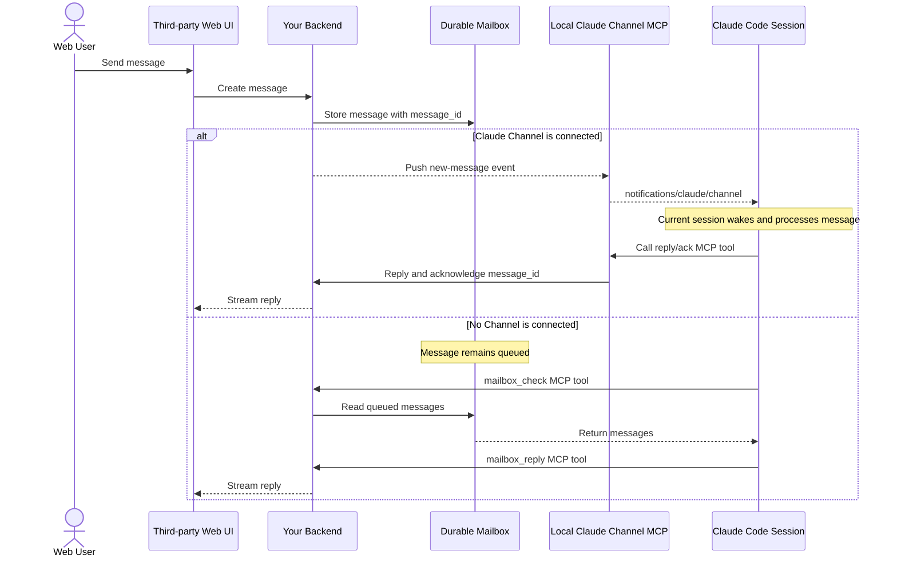
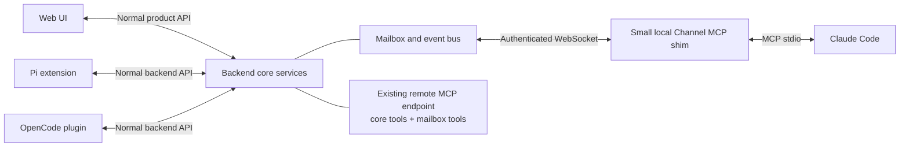

Yes—your mailbox assumption is right.

The clean model is:

- Mailbox = durable backend data.
- MCP tools = an agent-facing wrapper around that mailbox API.
- Claude Channel = the live push/wake mechanism layered on top.
- Reply tool = the return path from Claude to your backend.

Channels do not replace the mailbox. They make it reactive.



Anthropic Channels use a local MCP server connected to Claude Code over stdio. That server emits the Claude-specific `notifications/claude/channel` notification. Claude replies through an ordinary MCP tool exposed by that server. [Claude Channels reference](https://code.claude.com/docs/en/channels-reference)

## The mailbox itself

Your backend starts with ordinary application operations:

```ts
interface MailboxService {
  enqueue(input: {
    bridgeSessionId: string;
    text: string;
    senderId: string;
  }): Promise<{ messageId: string }>;

  readPending(input: {
    bridgeSessionId: string;
    after?: string;
  }): Promise<MailboxMessage[]>;

  acknowledge(input: {
    messageId: string;
    consumerId: string;
  }): Promise<void>;

  reply(input: {
    messageId: string;
    text: string;
  }): Promise<void>;
}
```

That might be an HTTP API, internal service functions, or a database-backed queue. It is not inherently MCP.

Then MCP exposes it to agents:

```text
mailbox_check
mailbox_read
mailbox_acknowledge
mailbox_reply
```

The web UI talks to your normal backend API. It should not talk to MCP.

## When Channels gets involved

Channels enters only at the final connection to a live Claude Code session:

```text
Your backend
     ↕ WebSocket or event stream
Local Channel MCP process
     ↕ MCP stdio
Running Claude Code session
```

The lifecycle is:

1. Claude Code starts with that Channel enabled.
2. Claude Code spawns your local MCP Channel process.
3. The Channel process opens an outbound connection to your backend.
4. A web message is stored in your backend mailbox.
5. Your backend pushes a notification to the connected Channel process.
6. The Channel process emits `notifications/claude/channel`.
7. Claude reacts inside the current session.
8. Claude calls your `reply` or `acknowledge` MCP tool.
9. The Channel process forwards that result to your backend.

Channel notifications have no processing acknowledgment. Therefore, storing the message before pushing it is important. “Successfully wrote the notification to stdio” does not prove Claude processed it.

## If your backend already has an MCP server

You probably do not need another general-purpose MCP server.

Your architecture can be:



Your existing MCP endpoint can expose:

- Existing product functionality
- `mailbox_check`
- `mailbox_read`
- `mailbox_acknowledge`
- `mailbox_reply`

But you will probably still need the small local Claude Channel shim.

That is because an ordinary remote MCP endpoint is an agent-callable tool surface. It is not automatically attached as a persistent push channel to one particular running Claude Code session. Claude Channels currently expect a locally spawned stdio MCP process with the Channel capability.

### Recommended split

Keep the business logic in your backend:

```text
Backend service layer
├── Product HTTP/WebSocket API
├── Existing MCP handlers
├── Mailbox
└── Event bus
```

Keep the Channel shim extremely thin:

```text
Local Channel shim
├── Connect to backend event bus
├── Emit Claude Channel notifications
├── Expose reply/ack tools
└── Forward tool calls to backend
```

Do not reimplement your core functionality in the Channel shim. It should authenticate to and call the same backend service your existing MCP handlers use.

## Could you combine them?

Yes, if your existing MCP server is already:

- Local
- Spawned by Claude Code over stdio
- Persistent for the session
- Compatible with Claude’s Channel capability

Then the same MCP process can expose both your existing tools and the Channel capability:

```ts
capabilities: {
  tools: {},
  experimental: {
    "claude/channel": {},
  },
}
```

But if your existing MCP is remote HTTP, shared across users, or stateless, keep it separate from the local Channel shim.

## Across all agents

The resulting routes are:

| Harness | Reads mailbox through MCP? | Gets live push how? | Replies how? |
|---|---:|---|---|
| Pi | No | Extension receives backend command | Extension sends events directly |
| OpenCode | No | Plugin receives backend command | Plugin sends events directly |
| Claude + Channel | Optional fallback | Channel MCP notification | MCP reply tool |
| Claude baseline | Yes | No live push | MCP reply tool |
| Codex baseline | Yes | No live push | MCP reply tool |
| Codex app-server | No | Native JSON-RPC command | Native events |

So MCP remains useful, but it is not the universal internal transport. The universal part is your backend’s mailbox, event model, session model, and command API. MCP is merely one way certain agents access those services.