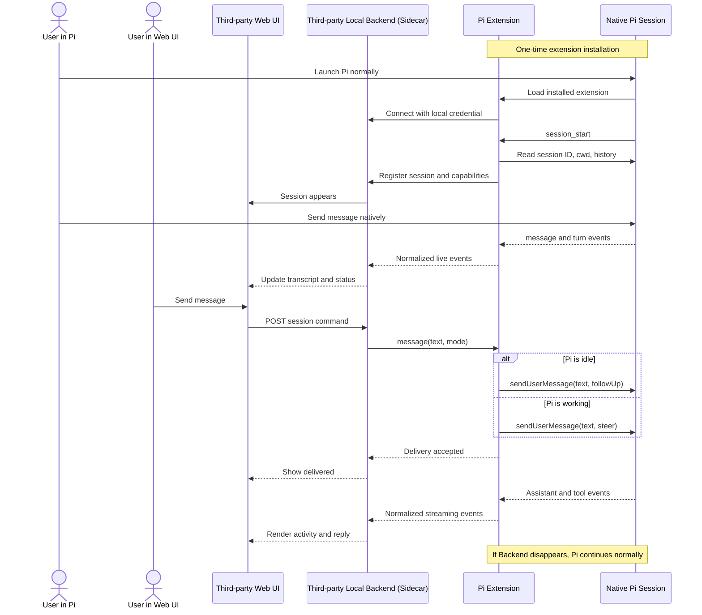
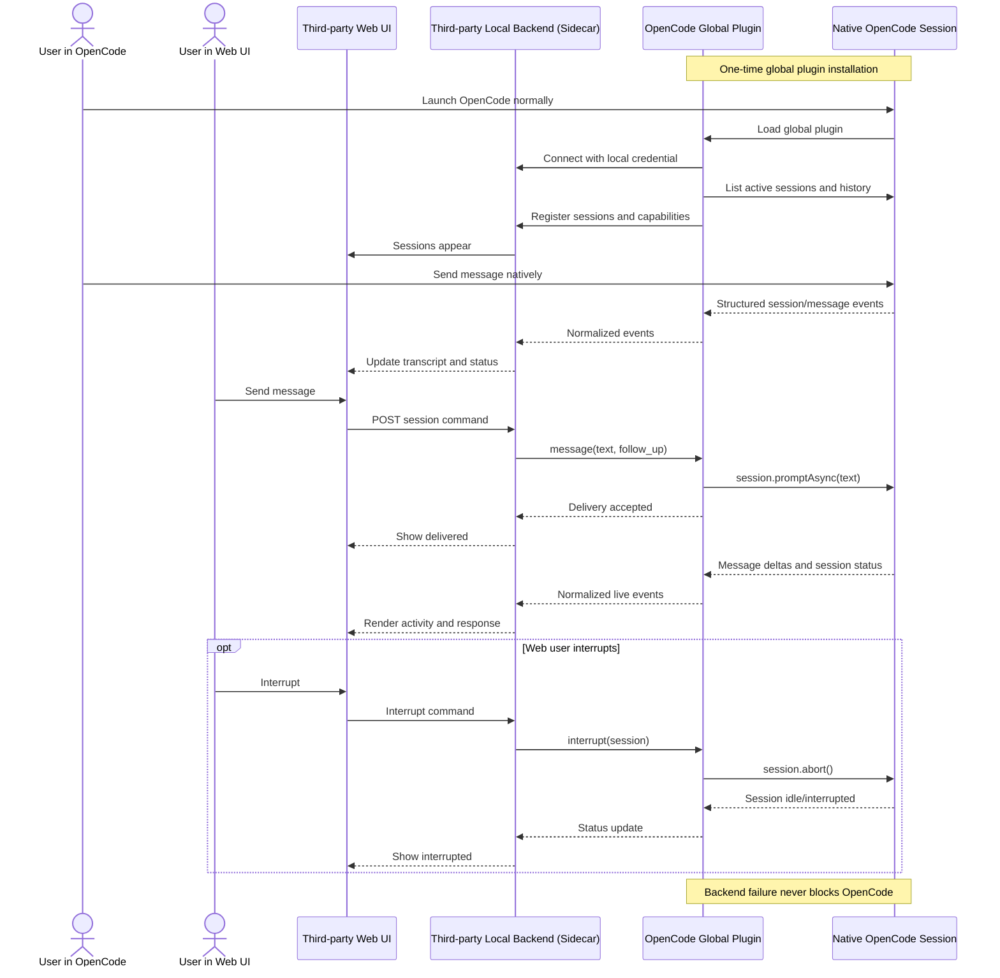

This was a discussion from an engineering consultant who knows how Pi and OpenCode extensions work.We're discussing how to communicate in words to agents, where basically you can gain a bidirectional experience. This doesn't always really exist with agents, but there's methods, especially for agents that support extensions.

Yes. If your third-party backend runs locally on the user’s machine, it can be the sidecar. “Sidecar” just means the local companion process beside the agent; it does not have to be a separate product or daemon.

```text
Your web UI
    ↕
Your existing local backend = sidecar responsibilities
    ↕
Pi extension / OpenCode plugin
    ↕
Native agent session
```

Your backend would own:

- Browser API and live event stream
- Session registry
- Normalized transcript/event journal
- Command routing
- Authentication between adapters and backend
- Delivery status
- Adapter discovery

If your backend is hosted remotely, it is not itself the sidecar. You would need a small local connector:

```text
Web UI ↔ Hosted backend ↔ Local sidecar ↔ Adapter ↔ Agent
```

But for the local-only prototype, your existing local backend should simply absorb the sidecar functionality. There is no reason to run two backend processes.

## Pi sequence



The Pi extension is directly inside the active Pi harness. MCP is not involved.

The important native operation is:

```ts
pi.sendUserMessage(text, {
  deliverAs: mode === "steer" ? "steer" : "followUp",
});
```

## OpenCode sequence



Again, no MCP is involved. The plugin directly calls OpenCode’s session API and receives its structured event hook.

One subtle difference: Pi currently has an explicit native distinction between `steer` and `followUp`. The OpenCode prototype uses `promptAsync` for message submission and `abort` for interruption; we should not represent it as confirmed Pi-style mid-turn steering until that behavior is proven.

So the practical architecture is:

```text
                          ┌─ Pi extension ────── Pi
Web UI ↔ Your backend ↔───┤
                          └─ OpenCode plugin ─── OpenCode
```

Both adapters speak the same bridge protocol to your backend. Only the last few feet—from adapter to native harness—are different.