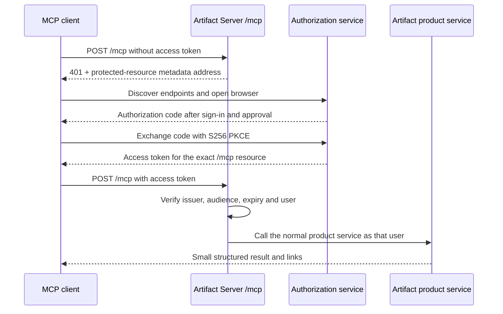

# Artifact Server MCP baseline

**Status:** Approved engineering baseline
**Date:** August 14, 2026
**Protocol target:** MCP `2026-07-28`, with stateless 2025-era client compatibility

## Decision

Artifact Server exposes one MCP control endpoint at `POST /mcp`. It uses the same artifact, version, permission, and comparison services as the browser application and normal HTTP API. MCP does not implement a second copy of product logic.

Large website and file bytes do not travel inside MCP messages. MCP starts an upload, returns short-lived upload instructions, and later commits the uploaded files as an immutable version.

The deployment chooses its authorization mode:

| Installation | Default | Optional alternative |
| --- | --- | --- |
| Hosted Artifact Server | WorkOS AuthKit browser OAuth | Artifact Server API key for CI and automation |
| Private or self-hosted server with compatible MCP OAuth | Browser OAuth through the configured authorization server | Artifact Server API key for CI, automation, and recovery |
| Private or self-hosted server without compatible MCP OAuth | Administrator-issued Artifact Server API key | Add a compatible external authorization server later |
| Self-hosted server that requires built-in browser OAuth | Not enabled by default | Better Auth MCP after its beta path passes the release test matrix |
| One laptop | `artifactserver connect` and the local stdio helper | None required for normal use |

WorkOS is the hosted authorization server. Artifact Server is the protected resource. WorkOS handles browser sign-in, approval, client identity or registration, authorization codes, access tokens, refresh tokens, and grant revocation. Artifact Server verifies the resulting access token and maps it to a local account admitted to that installation.

One standalone Artifact Server installation is one closed trust domain: one person or one team. It does not copy WorkOS organizations into a second organization system. Public self-registration is not supported.

An OpenID Connect login by itself is not a complete MCP authorization server. Remote MCP also requires protected-resource discovery, authorization-server discovery, resource-bound access tokens, PKCE, client identity or registration, approval, refresh, and revocation.

## Official connection and authentication paths

These are product requirements. Reading a token from startup output is not a
supported onboarding path.

| Condition | Human steps | Credential handling |
| --- | --- | --- |
| Local, single user | Install Artifact Server, run `artifactserver connect`, select a client only when more than one supported client is found, then use the client. | `artifactserver connect` registers `artifactserver mcp`. The helper starts or locates the local service and handles its private local credential. The user does not sign in, create a key, copy a key, or read logs. |
| Hosted or team server with compatible MCP OAuth | Add or select the server's `/mcp` address, complete browser sign-in and approval, then return to the client. | The client stores and renews the grant. Artifact Server verifies it on every request. |
| Private-network team server with compatible MCP OAuth | Connect to the required company network or VPN, add the `/mcp` address, then complete the same browser sign-in and approval. | Network reachability and application authorization remain separate. The login does not open a firewall or create a tunnel. |
| Self-hosted server without compatible MCP OAuth | An administrator creates a scoped API key in the administration interface or administrator CLI. The developer adds it once through the client's secret input. | Keys never appear in startup logs, project files, command history generated by Artifact Server, or ordinary diagnostic output. |
| CI, scripts, and unattended agents | An administrator creates a service API key and places it in the deployment's secret manager. | The key identifies one service principal and carries only its granted capabilities. No browser is involved. |

Artifact viewing has a separate rule: an account-required artifact opens after
normal Artifact Server sign-in; a public artifact opens without sign-in. An MCP
credential does not become a browser cookie.

### Local connection

`artifactserver connect` is the supported local onboarding command. It starts
or locates the per-user service, registers `artifactserver mcp` through the
selected client's normal local stdio configuration, verifies a real discovery
call, and prints only the selected client and local server address.

`artifactserver connect <client>` provides a non-interactive client choice.
`artifactserver disconnect <client>` removes the registration.
`artifactserver doctor` reports service, client-registration, and reachability
problems without revealing credentials.

The stdio helper is a transport bridge over the same authenticated loopback
`/mcp` endpoint used by the product. It does not define tools, implement
artifact rules, or write directly to the database. Its private local credential
is retrieved from a user-only file and never shown, placed in client
configuration, or passed as a process argument.

### Remote connection

For the hosted service:

1. The user adds `https://artifactserver.com/mcp` to Codex, Claude Code, or another remote MCP client.
2. The client calls `/mcp` without a credential.
3. Artifact Server returns `401 Unauthorized` and the address of its protected-resource metadata.
4. The client reads that metadata, discovers WorkOS AuthKit, and opens a browser.
5. The user signs in and approves the Artifact Server connection.
6. The client completes the authorization-code flow with S256 PKCE.
7. The client stores the access and refresh credentials and calls `/mcp` with an access token issued for the exact Artifact Server MCP address.
8. Artifact Server verifies the token, creates an internal principal, and applies normal product permissions.

The same steps apply to a team or private deployment that configures a
compatible MCP authorization server. The client must first be able to reach a
private server. If the deployment has no compatible MCP OAuth provider, it uses
the administrator-issued API-key path instead.



## Protocol shape

The primary implementation uses the released MCP `2026-07-28` protocol and the official TypeScript SDK version 2.

- `server/discover` replaces the old initialization handshake.
- Every request is independent and carries its protocol version and client capabilities.
- The modern endpoint does not use `initialize`, `notifications/initialized`, `Mcp-Session-Id`, sticky routing, `GET /mcp`, `DELETE /mcp`, or replay through `Last-Event-ID`.
- Application state uses explicit values such as `uploadId`, `operationId`, `artifactId`, and `versionId`.
- Ordinary results use JSON.
- A request-scoped server-sent event response is used only when progress materially helps.
- The first release rejects `subscriptions/listen`. It is enabled only after the deployment has a shared event service and tested fan-out, capacity, cancellation, and reconnect behavior.
- The official SDK's stateless 2025-era path is enabled because current Codex requires it. It uses `initialize` only inside that request family, creates a fresh server for every request, and adds no session identifier, sticky routing, GET stream, DELETE session operation, or replay state.

The server instructions begin with the normal workflow:

> Find the artifact, begin an upload if needed, complete the upload, publish against the version you started from, then inspect the immutable saved version.

## HTTP and wire rules

The outer HTTP route authenticates and validates the request before the MCP SDK dispatches it.

- Accept only `POST` on `/mcp` for both protocol eras.
- Require `Content-Type: application/json`.
- Support the response types required by Streamable HTTP clients.
- Require and validate `MCP-Protocol-Version` on modern requests.
- Require `Mcp-Method` on JSON-RPC request POSTs.
- Require `Mcp-Name` for named calls such as `tools/call` and `resources/read`.
- Reject header and body disagreement before tool dispatch.
- Validate `Origin` when present.
- Validate `Host` at the application edge; loopback servers accept only loopback hosts.
- Return JSON or MCP errors, never an HTML error page.

The current revision does not define the same header requirements for notification-only POSTs. Tests must not invent stricter protocol rules accidentally.

## Hosted OAuth contract

### Canonical values

- Protected resource and token audience: `https://artifactserver.com/mcp`
- Product authorization: exact resource-bound audience for the `/mcp` URL
- WorkOS issuer: the exact AuthKit origin configured for the environment
- Staging and production use different issuers, resources, grants, and tests

The canonical resource has no trailing slash, query, or fragment. Another installation uses the exact public origin of that installation plus `/mcp`.

### Artifact Server metadata

Artifact Server serves RFC 9728 Protected Resource Metadata at:

- `/.well-known/oauth-protected-resource/mcp`

The root `/.well-known/oauth-protected-resource` alias is optional
compatibility, not a first-release requirement for the `/mcp` resource.

The document names:

```json
{
  "resource": "https://artifactserver.com/mcp",
  "authorization_servers": ["https://AUTHKIT_ORIGIN"],
  "bearer_methods_supported": ["header"]
}
```

An unauthenticated or invalid request returns `401` with a challenge equivalent to:

```http
WWW-Authenticate: Bearer resource_metadata="https://artifactserver.com/.well-known/oauth-protected-resource/mcp"
```

WorkOS identity scopes such as `openid`, `profile`, `email`, and
`offline_access` do not grant product access. The exact resource-bound audience
for the MCP URL does. Artifact Server applies operation permissions after it
maps the token to an internal principal.

Compatibility aliases for authorization-server metadata may proxy or cache WorkOS metadata. They must not rewrite its issuer or endpoint addresses.

### Client registration and browser flow

- Prefer Client ID Metadata Documents (CIMD).
- Keep Dynamic Client Registration (DCR) enabled during the compatibility period.
- Support pre-registered clients when a company requires them.
- Use the authorization-code grant for interactive clients.
- Require S256 PKCE and exact redirect URI matching.
- Validate the authorization response issuer.
- Configure the exact `/mcp` address as the WorkOS Resource Indicator and make it the default for clients that omit `resource`.

DCR is deprecated in MCP `2026-07-28`, but current clients do not all use CIMD. Removal is a later compatibility decision, not a launch assumption.

### Token verification

Artifact Server verifies, at minimum:

- signature using a cached and rotation-safe key set;
- an explicit allowed signing algorithm;
- exact issuer;
- exact audience equal to the canonical MCP resource;
- expiry and optional not-before time;
- a nonempty subject.

The live WorkOS staging environment issues five-minute access tokens and rotating
refresh tokens to the tested MCP clients. WorkOS can revoke one user's grant for
one client through its Authorized Applications API. The old refresh grant then
fails, while the user and client remain available. Deleting an isolated dynamic
Connect application also invalidates its grants, but that broader operation is
for retiring an unused client, not ordinary user disconnect. WorkOS does not
advertise a standard OAuth revocation endpoint in this environment.

Artifact Server never forwards the OAuth access token to storage, background jobs, published websites, or another service. The verifier converts it once to an internal principal such as:

```ts
type Principal = {
  userId: string;
  installationId: string;
  roles: string[];
  scopes: string[];
  clientId?: string;
  authMethod: "oauth" | "api_key" | "local";
};
```

Provider-specific claims stop at this boundary. Product services do not know whether WorkOS, Better Auth, or another authorization server produced the principal.

## Product authorization

A valid token maps the caller to an account admitted to this installation. That account can read account-required artifacts because the installation is one closed person or team. It does not automatically grant permission to publish a new version, change access, restore, or delete.

- Map the OAuth subject to one local Artifact Server user admitted to this installation.
- Do not accept a user merely because an authorization provider authenticated them. Admission is controlled by the installation administrator or configured company login.
- Verify artifact ownership or an explicit write capability on every upload, publish, access-setting change, restore, and delete.
- Bind upload and operation handles to the verified principal and installation.
- API keys bind to a local user or service principal, installation, capabilities, expiry, and revoke state.
- MCP handlers call the same authorization layer as the browser and normal HTTP API.

Plannotator-connected projects use the normal Artifact Server project, artifact,
version, storage, audit, and access model. They do not live in a separate
namespace. A delegated Plannotator request uses a short-lived capability bound
to the paired installation and project, exact artifact or version when
applicable, path, action, and expiry. A workspace-scoped read capability may
open one referenced version, but it cannot list the project library or mutate
the artifact.

WorkOS scopes describe identity and refresh behavior; they do not grant Artifact
Server operations. Artifact Server keeps file, artifact, version, visibility,
publish, and delete permissions in its own policy model. Add product scopes only
if a future authorization provider or customer demonstrates a real need.

## Local and self-hosted authorization

### Laptop

Use `artifactserver connect` and the local stdio bridge. It does not use browser
OAuth. The bridge retrieves the private local credential automatically from a
user-only file. That credential is never a human setup step. The local helper
calls the same loopback `/mcp` endpoint and does not write directly to the
database.

### Private or self-hosted server

Prefer browser OAuth when the installation has an external authorization server
that provides the complete MCP OAuth contract: protected-resource discovery,
authorization-server metadata, resource-bound tokens, PKCE, approval, refresh,
revocation, and a workable registration method. Without one, the supported
fallback is a revocable Artifact Server API key created through the
administration interface or administrator CLI. Startup output is never a key
distribution channel.

Generic OIDC may authenticate users for the browser application. It is not sufficient for MCP unless the same system also provides the full authorization-server behavior above.

### Optional embedded OAuth

Better Auth 1.7's MCP, OAuth Provider, JWT, and CIMD packages are the current embedded candidate. Its current MCP path is marked beta. It should not become a supported default until it passes:

- CIMD and DCR tests with current Codex and Claude Code;
- exact audience and issuer tests;
- refresh rotation, retry, and revoke tests;
- redirect, PKCE, replay, SSRF, and hostile metadata tests;
- schema migration and recovery tests on SQLite, Postgres, and Cloudflare-supported storage.

Choosing embedded OAuth means Artifact Server owns durable client, consent, access-token, refresh-token, and replay state plus login and approval pages. It is a real product commitment, not a small middleware switch.

## MCP tools and resources

Start with a small, explicit tool surface:

| Tool | Purpose |
| --- | --- |
| `artifact_capabilities` | Report the upload workflow, deployment mode, sharing settings, and current limits. |
| `artifact_list` | Find artifacts the current principal may access. |
| `artifact_get` | Read artifact metadata, the current immutable version, and its complete manifest. |
| `artifact_open` | Return the canonical browser link for the selected artifact and exact version when requested. The client opens it on the user's computer. |
| `artifact_create_upload` | Create an expiring upload handle and direct-upload plan. |
| `artifact_commit_upload` | Verify the manifest and publish an immutable version. |
| `artifact_set_visibility` | Change between account-required and public-link access when permitted. A public link opens only the current version. Warn that public copies cannot be recalled and perform the configured CDN purge when returning to account-required. |
| `artifact_set_tags` | Replace the artifact's normalized tag set without changing its saved files. |
| `artifact_version_list` | List immutable saved versions and their exact content addresses. Use `artifact_open` when a user needs an authorized browser address. |
| `artifact_diff` | Return a bounded comparison summary and a link to the full comparison. |
| `artifact_restore_version` | Make an existing immutable version current again. |
| `artifact_delete` | Delete one artifact after an optimistic current-version check. |

The first read-only resource template exposes one bounded version manifest:

- `artifact://projects/{projectId}/artifacts/{artifactId}/versions/{versionId}/manifest`

Files and complete websites return HTTPS links. Authenticated list and resource
results use private cache scope.

Publishing always starts from an actual file or finished directory selected on
the client. MCP does not accept raw HTML, CSS, JavaScript, base64 file contents,
or an arbitrary client path. The authenticated Artifact Server CLI owns the
normal local-file path. It uploads the selected bytes through the returned
upload plan, then calls the corresponding commit operation. An MCP client whose
own runtime already has the bytes may use `artifact_create_upload` and
`artifact_commit_upload` directly. These transport steps remain one "publish
this file or directory" operation to the user. No MCP tool accepts a client
filesystem path.

MCP and the CLI intentionally overlap for server-only artifact operations.
Both adapt the same application services and authorization rules. The
`publish-artifact` skill selects the CLI when local file access is required and
may use either adapter when all required data already exists on the server.

Do not add prompts in the first release. Do not build new dependencies on deprecated MCP Roots, Sampling, or Logging.

## Direct upload flow

1. `artifact_create_upload`, or the corresponding CLI and HTTP operation, creates a principal- and installation-bound staging record and returns an `uploadId`, expiry, request limits, and upload instructions for each declared file.
2. The authenticated CLI sends each file according to those instructions. It uses its own server profile; it never copies an MCP credential. A temporary upload address, when returned, is bound to one principal, project, upload, storage token, declared size, fingerprint, and expiry and is limited to that upload slot. An exact retry after a lost response returns success; different bytes fail. Artifact Server writes those bytes through the deployment's local-disk, S3, R2, or compatible storage adapter. The first release does not promise multipart or storage-provider URLs.
3. The client submits a manifest containing normalized portable relative paths, media type, byte length, SHA-256 fingerprint, entry file, and routing mode. The server rejects traversal, absolute paths, `.git` components, encoded separators, symlinks, special files, and case or Unicode collisions.
4. `artifact_commit_upload` verifies every size and fingerprint, writes missing final blobs without overwriting an existing object, computes the canonical manifest digest, and seals the upload.
5. In one database transaction it stores the version, manifest, idempotency result, and conditional current-version update.
6. The result returns artifact ID, version ID, manifest digest, access setting, main link, saved-version link, and optional Git commit ID.

The user and agent see one CLI action even when the upload plan uses several
HTTP requests. Upload identifiers, temporary addresses, bearer credentials,
fingerprints, and retry state stay inside the client and never enter model
context or project configuration.

Every durable mutation requires an application idempotency key. A mutation of
an existing artifact also requires the current version the caller started
from. Creating a new artifact has no earlier version to supply. Creating an
uncommitted upload is disposable staging preparation, not a durable artifact
mutation.

The publish commit requires:

- a caller-supplied idempotency key;
- the version the caller started from when moving the current pointer;
- immutable file or upload identifiers.

Persist the successful idempotency result and request digest. If the HTTP response is lost after commit, retrying the same key and input returns the same result. Reusing that key with different input is rejected. A concurrent publish returns a tool-level conflict with the actual current version.

A new idempotency key is an intentional new publish and creates a new version even when the canonical manifest digest matches an earlier version. The initial release deletes only expired staging uploads. It retains committed and orphaned blobs until a lease-based or mark-and-sweep garbage collector passes concurrency and crash-recovery tests.

## Subscriptions and progress

The first release does not advertise change subscriptions and rejects `subscriptions/listen` before opening a stream.

If subscriptions are later justified:

- one local process may use an in-memory event bus;
- Kubernetes needs shared pub/sub such as Postgres, Redis, or NATS;
- Cloudflare needs a shared Durable Object or equivalent fan-out component;
- every implementation needs bounded capacity, authorization filters, cancellation, reconnect, and multi-instance tests.

Status polling remains the compatibility fallback. An open event stream with no reliable event source is not support.

## Release test matrix

| Area | Required checks |
| --- | --- |
| Modern wire | `server/discover`, protocol selection, per-request metadata, required headers, header/body mismatch, result type, cache fields, unsupported version, 405 on modern GET and DELETE |
| Authorization | no token, bad signature, wrong issuer, wrong audience, missing subject, expired token, revoked refresh grant, hostile Origin and Host |
| Installation safety | user not admitted to the installation, upload handle from another principal, removed member, changed role, list filtering |
| Publishing | expired upload, hash mismatch, multipart retry, traversal, encoded separators, `.git` paths, symlink escape, case and Unicode collisions, oversized manifest, idempotent replay, intentional identical publish, lost response after commit, concurrent current-version update, and cleanup racing a commit |
| Hosts | fresh and stale-state tests in Codex, Claude Code, Claude.ai, and one DCR-only client |
| Deployments | loopback for release 1; one server and multi-container Kubernetes, including AKS, for release 2; Cloudflare for release 3; AWS and GCP packages for release 4 |
| Required compatibility | exact `2025-06-18` initialization and a real 2025-era tool call tested separately without adding sessions, GET/DELETE operations, replay, or old behavior to the modern request family |

## MCP release critical path

An MCP delivery mode is not released until its applicable path passes in the
real supported clients. Protocol conformance alone is insufficient.

1. **Shared product adapter:** stdio and HTTP use one MCP catalog, one
   authorization service, and one artifact service. No transport contains a
   second implementation of product rules.
2. **Local zero-secret onboarding:** `artifactserver connect`,
   `artifactserver mcp`, `artifactserver disconnect`, and
   `artifactserver doctor` work from a clean installation. Codex, Claude Code,
   Cursor, and VS Code can discover and call the local server without a browser,
   visible token, copied secret, Docker requirement, or startup-log inspection.
3. **Remote browser onboarding:** adding only the `/mcp` address triggers
   discovery, browser sign-in, approval, callback, tool use, automatic renewal,
   revoke, and reconnect in every advertised remote client.
4. **Private-network behavior:** a reachable private server completes the same
   browser flow when compatible OAuth is configured. An unreachable server
   fails with a clear network error and never claims that sign-in changes
   firewall or VPN access.
5. **API-key fallback:** a self-hosted administrator can issue, scope, rotate,
   and revoke user or service keys through an administration surface. CI can use
   a service key non-interactively. No supported path obtains a key from logs.
6. **Client installation surfaces:** provide a native one-click installation
   where a client supports it and one copyable command or configuration where it
   does not. Test fresh installation, existing configuration, upgrade,
   disconnect, stale credentials, and reauthorization.
7. **Proof:** record normal and hostile test evidence for each supported client
   and deployment in `conformance.yml`. A path with missing real-client evidence
   is documented as unsupported, not inferred to work.

The local release is gated by steps 1, 2, 5, 6, and 7 for local mode. A private
team release is additionally gated by steps 3 or 5 according to its advertised
authorization mode, plus step 4 for private networking. The hosted release is
gated by every step except the self-hosted API-key onboarding variant.

Claude.ai runs outside the user's private network. A private-only Artifact Server is not reachable from claude.ai without controlled public ingress. Codex and Claude Code running on a machine inside that network can still connect.

## Staging findings and remaining questions

The August 16, 2026 WorkOS staging probe answered:

- the access-token lifetime is 300 seconds;
- refresh tokens rotate;
- the exact resource indicator becomes the JWT audience;
- WorkOS issues identity scopes (`openid`, `profile`, `email`, and
  `offline_access`) rather than a separate `mcp` product scope;
- Codex uses DCR and requested MCP `2025-06-18`;
- Claude Code uses CIMD;
- Cursor uses DCR;
- deleting one user's Authorized Application revokes that user's refresh grant
  without deleting the user or client;
- deleting an unused dynamic Connect application retires that whole client and
  invalidates its remaining grants.

The remaining provider and client questions are:

1. What are the DCR rate, duplicate-registration, cleanup, and retention rules?
2. Does an omitted `resource` still produce the exact `/mcp` audience when the
   default Resource Indicator is set?
3. Do fresh and stale cached connections work in claude.ai and Visual Studio
   Code?

The Better Auth probe must additionally prove its beta CIMD profile, storage migrations, and Cloudflare compatibility before the embedded mode is supported.

## Primary references

- [MCP 2026-07-28 release](https://blog.modelcontextprotocol.io/posts/2026-07-28/)
- [MCP authorization specification](https://modelcontextprotocol.io/specification/draft/basic/authorization)
- [WorkOS AuthKit for MCP](https://workos.com/docs/authkit/mcp)
- [WorkOS Authorized Applications API](https://workos.com/docs/reference/authkit/user/create)
- [Better Auth MCP beta](https://better-auth.com/docs/beta/plugins/mcp)
- [Claude Code MCP](https://code.claude.com/docs/en/mcp)
- [Codex MCP](https://developers.openai.com/codex/mcp/)
