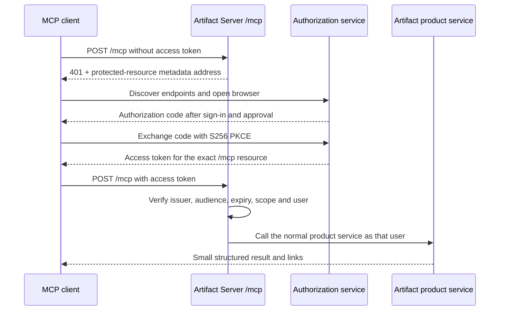

# Artifact Server MCP baseline

**Status:** Proposed engineering baseline
**Date:** August 12, 2026
**Protocol target:** MCP `2026-07-28`

## Decision

Artifact Server exposes one MCP control endpoint at `POST /mcp`. It uses the same artifact, version, permission, and comparison services as the browser application and normal HTTP API. MCP does not implement a second copy of product logic.

Large website and file bytes do not travel inside MCP messages. MCP starts an upload, returns short-lived upload instructions, and later commits the uploaded files as an immutable version.

The deployment chooses its authorization mode:

| Installation | Default | Optional alternative |
| --- | --- | --- |
| Hosted Artifact Server | WorkOS AuthKit browser OAuth | Artifact Server API key for CI and automation |
| Private or self-hosted server | Artifact Server API key | Existing compatible OAuth authorization server |
| Self-hosted server that requires built-in browser OAuth | Not enabled by default | Better Auth MCP after its beta path passes the release test matrix |
| One laptop | Local helper and local token | Loopback HTTP with a short-lived local token |

WorkOS is the hosted authorization server. Artifact Server is the protected resource. WorkOS handles browser sign-in, approval, client identity or registration, authorization codes, access tokens, refresh tokens, and grant revocation. Artifact Server verifies the resulting access token and maps it to a local account admitted to that installation.

One standalone Artifact Server installation is one closed trust domain: one person or one team. It does not copy WorkOS organizations into a second organization system. Public self-registration is not supported.

An OpenID Connect login by itself is not a complete MCP authorization server. Remote MCP also requires protected-resource discovery, authorization-server discovery, resource-bound access tokens, PKCE, client identity or registration, approval, refresh, and revocation.

## Connection experience

For the hosted service:

1. The user adds `https://artifactserver.com/mcp` to Codex, Claude Code, or another remote MCP client.
2. The client calls `/mcp` without a credential.
3. Artifact Server returns `401 Unauthorized` and the address of its protected-resource metadata.
4. The client reads that metadata, discovers WorkOS AuthKit, and opens a browser.
5. The user signs in and approves the Artifact Server connection.
6. The client completes the authorization-code flow with S256 PKCE.
7. The client stores the access and refresh credentials and calls `/mcp` with an access token issued for the exact Artifact Server MCP address.
8. Artifact Server verifies the token, creates an internal principal, and applies normal product permissions.



## Protocol shape

The primary implementation uses the released MCP `2026-07-28` protocol and the official TypeScript SDK version 2.

- `server/discover` replaces the old initialization handshake.
- Every request is independent and carries its protocol version and client capabilities.
- The modern endpoint does not use `initialize`, `notifications/initialized`, `Mcp-Session-Id`, sticky routing, `GET /mcp`, `DELETE /mcp`, or replay through `Last-Event-ID`.
- Application state uses explicit values such as `uploadId`, `operationId`, `artifactId`, and `versionId`.
- Ordinary results use JSON.
- A request-scoped server-sent event response is used only when progress materially helps.
- The first release rejects `subscriptions/listen`. It is enabled only after the deployment has a shared event service and tested fan-out, capacity, cancellation, and reconnect behavior.
- Older MCP behavior is an isolated compatibility handler or route. It is enabled only for a client that has been tested and proven to need it.

The server instructions begin with the normal workflow:

> Find the artifact, begin an upload if needed, complete the upload, publish against the version you started from, then inspect the immutable saved version.

## HTTP and wire rules

The outer HTTP route authenticates and validates the request before the MCP SDK dispatches it.

- Accept only `POST` on the modern `/mcp` route.
- Require `Content-Type: application/json`.
- Support the response types required by Streamable HTTP clients.
- Require and validate `MCP-Protocol-Version` on modern requests.
- Require `Mcp-Method` on JSON-RPC request POSTs.
- Require `Mcp-Name` for named calls such as `tools/call` and `resources/read`.
- Reject header and body disagreement before tool dispatch.
- Validate `Origin` when present.
- Validate `Host` at the application edge; loopback servers accept only loopback hosts.
- Return JSON or MCP errors, never an HTML error page.

The current revision does not define the same header requirements for notification-only POSTs. Tests must not invent stricter protocol rules accidentally.

## Hosted OAuth contract

### Canonical values

- Protected resource and token audience: `https://artifactserver.com/mcp`
- Product scope: `mcp`
- WorkOS issuer: the exact AuthKit origin configured for the environment
- Staging and production use different issuers, resources, grants, and tests

The canonical resource has no trailing slash, query, or fragment. Another installation uses the exact public origin of that installation plus `/mcp`.

### Artifact Server metadata

Artifact Server serves RFC 9728 Protected Resource Metadata at both:

- `/.well-known/oauth-protected-resource/mcp`
- `/.well-known/oauth-protected-resource` as a compatibility alias

The document names:

```json
{
  "resource": "https://artifactserver.com/mcp",
  "authorization_servers": ["https://AUTHKIT_ORIGIN"],
  "bearer_methods_supported": ["header"],
  "scopes_supported": ["mcp"]
}
```

An unauthenticated or invalid request returns `401` with a challenge equivalent to:

```http
WWW-Authenticate: Bearer resource_metadata="https://artifactserver.com/.well-known/oauth-protected-resource/mcp"
```

A valid token that lacks the required scope returns `403` with `error="insufficient_scope"` and `scope="mcp"`.

Compatibility aliases for authorization-server metadata may proxy or cache WorkOS metadata. They must not rewrite its issuer or endpoint addresses.

### Client registration and browser flow

- Prefer Client ID Metadata Documents (CIMD).
- Keep Dynamic Client Registration (DCR) enabled during the compatibility period.
- Support pre-registered clients when a company requires them.
- Use the authorization-code grant for interactive clients.
- Require S256 PKCE and exact redirect URI matching.
- Validate the authorization response issuer.
- Configure the exact `/mcp` address as the WorkOS Resource Indicator and make it the default for clients that omit `resource`.

DCR is deprecated in MCP `2026-07-28`, but current clients do not all use CIMD. Removal is a later compatibility decision, not a launch assumption.

### Token verification

Artifact Server verifies, at minimum:

- signature using a cached and rotation-safe key set;
- an explicit allowed signing algorithm;
- exact issuer;
- exact audience equal to the canonical MCP resource;
- expiry and optional not-before time;
- a nonempty subject;
- the exact `mcp` scope.

The target access-token lifetime is no more than 60 minutes, subject to confirmation in a WorkOS staging environment. Refresh tokens should rotate and each client grant must be independently revocable.

Artifact Server never forwards the OAuth access token to storage, background jobs, published websites, or another service. The verifier converts it once to an internal principal such as:

```ts
type Principal = {
  userId: string;
  installationId: string;
  roles: string[];
  scopes: string[];
  clientId?: string;
  authMethod: "oauth" | "api_key" | "local";
};
```

Provider-specific claims stop at this boundary. Product services do not know whether WorkOS, Better Auth, or another authorization server produced the principal.

## Product authorization

A valid token maps the caller to an account admitted to this installation. That account can read account-required artifacts because the installation is one closed person or team. It does not automatically grant permission to publish a new version, change access, restore, or delete.

- Map the OAuth subject to one local Artifact Server user admitted to this installation.
- Do not accept a user merely because an authorization provider authenticated them. Admission is controlled by the installation administrator or configured company login.
- Verify artifact ownership or an explicit write capability on every upload, publish, access-setting change, restore, and delete.
- Bind upload and operation handles to the verified principal and installation.
- API keys bind to a local user or service principal, installation, capabilities, expiry, and revoke state.
- MCP handlers call the same authorization layer as the browser and normal HTTP API.

Plannotator-managed artifacts live in a separate externally authorized namespace. Ordinary Artifact Server OAuth sessions and API keys cannot list or read that namespace. A Plannotator integration uses a short-lived capability bound to the exact storage boundary, artifact, version, path, action, and expiry.

The proposed single OAuth scope is intentionally coarse. Artifact Server keeps file, artifact, version, visibility, publish, and delete permissions in its own policy model. Add separate read and write OAuth scopes only after a client or customer demonstrates a real need.

## Local and self-hosted authorization

### Laptop

Use a local helper or loopback HTTP listener and a short-lived local token. Stdio reads its credential from the environment or operating-system keychain. It does not use browser OAuth.

The local helper is only a transport adapter. It calls the same product service and does not write directly to the database.

### Private or self-hosted server

The default is a revocable Artifact Server API key. An installation may instead configure an external authorization server if it provides the complete MCP OAuth contract: protected-resource discovery, authorization-server metadata, resource-bound tokens, PKCE, approval, refresh, revocation, and a workable registration method.

Generic OIDC may authenticate users for the browser application. It is not sufficient for MCP unless the same system also provides the full authorization-server behavior above.

### Optional embedded OAuth

Better Auth 1.7's MCP, OAuth Provider, JWT, and CIMD packages are the current embedded candidate. Its current MCP path is marked beta. It should not become a supported default until it passes:

- CIMD and DCR tests with current Codex and Claude Code;
- exact audience and issuer tests;
- refresh rotation, retry, and revoke tests;
- redirect, PKCE, replay, SSRF, and hostile metadata tests;
- schema migration and recovery tests on SQLite, Postgres, and Cloudflare-supported storage.

Choosing embedded OAuth means Artifact Server owns durable client, consent, access-token, refresh-token, and replay state plus login and approval pages. It is a real product commitment, not a small middleware switch.

## MCP tools and resources

Start with a small, explicit tool surface:

| Tool | Purpose |
| --- | --- |
| `artifact_capabilities` | Report upload, local-file, public-link, Git-history, and size options for this installation. |
| `artifact_list` | Find artifacts the current principal may access. |
| `artifact_get` | Read bounded artifact metadata and current-version information. |
| `artifact_open` | Return the canonical browser link for the selected artifact and exact version when requested. The client opens it on the user's computer. |
| `artifact_publish_inline` | Publish small text or a small single file. |
| `artifact_create_upload` | Create an expiring upload handle and direct-upload plan. |
| `artifact_commit_upload` | Verify the manifest and publish an immutable version. |
| `artifact_link_local` | Import a file from an explicitly allowed local root. Local installations only. |
| `artifact_set_visibility` | Change between account-required and public-link access when permitted. A public link opens only the current version. Warn that public copies cannot be recalled and perform the configured CDN purge when returning to account-required. |
| `artifact_version_list` | List immutable saved versions. |
| `artifact_diff` | Return a bounded comparison summary and a link to the full comparison. |

Read-only resource templates may expose bounded version manifests and text files:

- `artifact://artifacts/{artifactId}/versions/{versionId}/manifest`
- `artifact://artifacts/{artifactId}/versions/{versionId}/files/{fileId}`

Large files, complete websites, and complete comparison reports return HTTPS resource links. Authenticated list and resource results use private cache scope.

Do not add prompts in the first release. Do not build new dependencies on deprecated MCP Roots, Sampling, or Logging.

## Direct upload flow

1. `artifact_create_upload` creates a principal- and installation-bound staging record and returns an `uploadId`, expiry, size limits, and signed single-part or multipart staging addresses.
2. The client uploads bytes to the staging namespace on local disk, S3, Google Cloud Storage, Azure Blob Storage, R2, or a compatible store.
3. The client submits a manifest containing normalized portable relative paths, media type, byte length, SHA-256 fingerprint, entry file, and routing mode. The server rejects traversal, absolute paths, `.git` components, encoded separators, symlinks, special files, and case or Unicode collisions.
4. `artifact_commit_upload` verifies every size and fingerprint, writes missing final blobs without overwriting an existing object, computes the canonical manifest digest, and seals the upload.
5. In one database transaction it stores the version, manifest, idempotency result, and conditional current-version update.
6. The result returns artifact ID, version ID, manifest digest, access setting, main link, saved-version link, and optional Git commit ID.

The publish call requires:

- a caller-supplied idempotency key;
- the version the caller started from when moving the current pointer;
- immutable file or upload identifiers.

Persist the successful idempotency result and request digest. If the HTTP response is lost after commit, retrying the same key and input returns the same result. Reusing that key with different input is rejected. A concurrent publish returns a tool-level conflict with the actual current version.

A new idempotency key is an intentional new publish and creates a new version even when the canonical manifest digest matches an earlier version. The initial release deletes only expired staging uploads. It retains committed and orphaned blobs until a lease-based or mark-and-sweep garbage collector passes concurrency and crash-recovery tests.

## Subscriptions and progress

The first release does not advertise change subscriptions and rejects `subscriptions/listen` before opening a stream.

If subscriptions are later justified:

- one local process may use an in-memory event bus;
- Kubernetes needs shared pub/sub such as Postgres, Redis, or NATS;
- Cloudflare needs a shared Durable Object or equivalent fan-out component;
- every implementation needs bounded capacity, authorization filters, cancellation, reconnect, and multi-instance tests.

Status polling remains the compatibility fallback. An open event stream with no reliable event source is not support.

## Release test matrix

| Area | Required checks |
| --- | --- |
| Modern wire | `server/discover`, protocol selection, per-request metadata, required headers, header/body mismatch, result type, cache fields, unsupported version, 405 on modern GET and DELETE |
| Authorization | no token, bad signature, wrong issuer, wrong audience, missing scope, expired token, revoked refresh grant, hostile Origin and Host |
| Installation safety | user not admitted to the installation, upload handle from another principal, removed member, changed role, list filtering |
| Publishing | expired upload, hash mismatch, multipart retry, traversal, encoded separators, `.git` paths, symlink escape, case and Unicode collisions, oversized manifest, idempotent replay, intentional identical publish, lost response after commit, concurrent current-version update, and cleanup racing a commit |
| Hosts | fresh and stale-state tests in Codex, Claude Code, Claude.ai, and one DCR-only client |
| Deployments | loopback for release 1; one server and multi-container Kubernetes for release 2; Cloudflare for release 3; AWS, GCP, and Azure packages for release 4 |
| Optional legacy | older initialization behavior tested separately without adding sessions or old transport behavior to the modern route |

Claude.ai runs outside the user's private network. A private-only Artifact Server is not reachable from claude.ai without controlled public ingress. Codex and Claude Code running on a machine inside that network can still connect.

## Staging questions

The WorkOS staging probe must answer:

1. Which setting controls the access-token lifetime for CIMD and DCR MCP clients?
2. How do refresh rotation, retries, and replay detection behave?
3. How does per-client and per-user revoke work, and what happens to already issued access tokens?
4. What exact client, Artifact Server installation, and scope information appears on the approval page?
5. What are the DCR rate, duplicate-registration, cleanup, and retention rules?
6. What are the live token claims and signing algorithm?
7. Does an omitted `resource` still produce the exact `/mcp` audience when the default Resource Indicator is set?
8. Do fresh and stale cached connections work in Codex, Claude Code, claude.ai, and the selected DCR-only client?

The Better Auth probe must additionally prove its beta CIMD profile, storage migrations, and Cloudflare compatibility before the embedded mode is supported.

## Primary references

- [MCP 2026-07-28 release](https://blog.modelcontextprotocol.io/posts/2026-07-28/)
- [MCP authorization specification](https://modelcontextprotocol.io/specification/draft/basic/authorization)
- [WorkOS AuthKit for MCP](https://workos.com/docs/authkit/mcp)
- [Better Auth MCP beta](https://better-auth.com/docs/beta/plugins/mcp)
- [Claude Code MCP](https://code.claude.com/docs/en/mcp)
- [Codex MCP](https://developers.openai.com/codex/mcp/)
